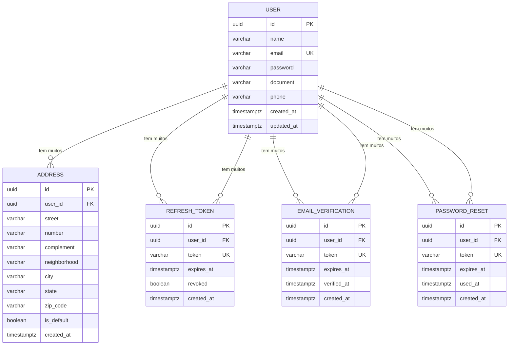

# Data Model — ecom-user-service

> Documento vivo do modelo de dados. Atualizado sempre que uma entidade for criada, alterada ou removida.
> **Ultima atualizacao:** 2026-06-16

---

## Indice

- [Visao Geral](#visao-geral)
- [Diagrama ER](#diagrama-er)
- [Entidades](#entidades)
- [Indices e Performance](#indices-e-performance)
- [Classificacao de Privacidade](#classificacao-de-privacidade)
- [Decisoes de Modelagem](#decisoes-de-modelagem)

---

## Visao Geral

Cinco entidades principais: `User` (usuarios do sistema), `Address` (enderecos vinculados a cada usuario), `RefreshToken` (tokens de renovacao de sessao), `EmailVerification` (verificacao de email) e `PasswordReset` (recuperacao de senha). O nucleo do dominio e o cadastro de usuarios com autenticacao via JWT e fluxos de seguranca.

**Banco de dados:** PostgreSQL 15
**ORM / acesso:** Hibernate via Spring Data JPA
**Extensoes relevantes:** uuid-ossp

---

## Diagrama ER

---

## Entidades

---

### User

> Entidade central do dominio. Representa um usuario registrado no sistema, com credenciais de acesso e dados pessoais.

**Tabela:** `users`
**Servico responsavel:** ecom-user-service

| Campo | Tipo SQL | Nullable | Default | Descricao |
|-------|----------|----------|---------|-----------|
| `id` | UUID | Nao | uuid_generate_v4() | Identificador unico do usuario |
| `name` | VARCHAR(255) | Nao | — | Nome completo do usuario |
| `email` | VARCHAR(255) | Nao | — | Email (usado para login) |
| `password` | VARCHAR(255) | Nao | — | Hash BCrypt da senha |
| `document` | VARCHAR(20) | Sim | NULL | CPF ou CNPJ |
| `phone` | VARCHAR(20) | Sim | NULL | Telefone de contato |
| `created_at` | TIMESTAMP | Nao | NOW() | Data de criacao do registro |
| `updated_at` | TIMESTAMP | Nao | NOW() | Data da ultima atualizacao |

**Constraints:**
- `UNIQUE(email)` — email deve ser unico para garantir unicidade de login e evitar duplicatas
- `CHECK (LENGTH(password) >= 60)` — BCrypt hash sempre tem 60 caracteres (validacao implicita via JPA)

**Relacionamentos:**
- Um `User` tem muitos `Address` via `addresses.user_id`

---

### Address

> Entidade que armazena enderecos de entrega ou cobranca associados a um usuario.

**Tabela:** `addresses`
**Servico responsavel:** ecom-user-service

| Campo | Tipo SQL | Nullable | Default | Descricao |
|-------|----------|----------|---------|-----------|
| `id` | UUID | Nao | uuid_generate_v4() | Identificador unico do endereco |
| `user_id` | VARCHAR(36) | Nao | — | FK para o usuario proprietario |
| `street` | VARCHAR(255) | Nao | — | Logradouro |
| `number` | VARCHAR(20) | Nao | — | Numero do imovel |
| `complement` | VARCHAR(255) | Sim | NULL | Complemento (apto, bloco, etc.) |
| `neighborhood` | VARCHAR(255) | Nao | — | Bairro |
| `city` | VARCHAR(255) | Nao | — | Cidade |
| `state` | VARCHAR(2) | Nao | — | UF (sigla de 2 caracteres) |
| `zip_code` | VARCHAR(9) | Nao | — | CEP (formato 00000000 ou 00000-000) |
| `is_default` | BOOLEAN | Nao | false | Indica se e o endereco padrao do usuario |
| `created_at` | TIMESTAMP | Nao | NOW() | Data de criacao do registro |

**Constraints:**
- `FOREIGN KEY (user_id) REFERENCES users(id)` — FK para a tabela `users`
- `CHECK (LENGTH(state) = 2)` — UF deve ter exatamente 2 caracteres

**Relacionamentos:**
- Muitos `Address` pertencem a um `User` via `addresses.user_id`

---

### RefreshToken

> Token de longa duracao (7 dias) usado para renovar o access token JWT sem reautenticacao. Implementa rotacao: a cada uso o token antigo e revogado e um novo e emitido.

**Tabela:** `refresh_tokens`
**Servico responsavel:** ecom-user-service

| Campo | Tipo SQL | Nullable | Default | Descricao |
|-------|----------|----------|---------|-----------|
| `id` | UUID | Nao | uuid_generate_v4() | Identificador unico do token |
| `user_id` | VARCHAR(36) | Nao | — | FK para o usuario dono do token |
| `token` | VARCHAR(36) | Nao | — | UUID do refresh token (unico) |
| `expires_at` | TIMESTAMPTZ | Nao | — | Data de expiracao (now + 7 days) |
| `revoked` | BOOLEAN | Nao | false | Indica se o token foi revogado (rotacao) |
| `created_at` | TIMESTAMP | Nao | NOW() | Data de criacao do registro |

**Constraints:**
- `UNIQUE(token)` — cada token deve ser unico para garantir a seguranca da rotacao
- `FOREIGN KEY (user_id) REFERENCES users(id)`

**Relacionamentos:**
- Muitos `RefreshToken` pertencem a um `User` via `refresh_tokens.user_id`

---

### EmailVerification

> Token de verificacao de email com validade de 24h. Permite confirmar que o usuario possui acesso ao email informado no cadastro.

**Tabela:** `email_verifications`
**Servico responsavel:** ecom-user-service

| Campo | Tipo SQL | Nullable | Default | Descricao |
|-------|----------|----------|---------|-----------|
| `id` | UUID | Nao | uuid_generate_v4() | Identificador unico do token |
| `user_id` | VARCHAR(36) | Nao | — | FK para o usuario |
| `token` | VARCHAR(36) | Nao | — | UUID do token de verificacao (unico) |
| `expires_at` | TIMESTAMP | Nao | — | Data de expiracao (now + 24h) |
| `verified_at` | TIMESTAMP | Sim | NULL | Momento em que o email foi verificado |
| `created_at` | TIMESTAMP | Nao | NOW() | Data de criacao do registro |

**Constraints:**
- `UNIQUE(token)` — cada token deve ser unico
- `FOREIGN KEY (user_id) REFERENCES users(id)`

**Relacionamentos:**
- Muitos `EmailVerification` pertencem a um `User` via `email_verifications.user_id`

---

### PasswordReset

> Token de recuperacao de senha com validade de 1h. Permite que o usuario redefina sua senha sem estar autenticado.

**Tabela:** `password_resets`
**Servico responsavel:** ecom-user-service

| Campo | Tipo SQL | Nullable | Default | Descricao |
|-------|----------|----------|---------|-----------|
| `id` | UUID | Nao | uuid_generate_v4() | Identificador unico do token |
| `user_id` | VARCHAR(36) | Nao | — | FK para o usuario |
| `token` | VARCHAR(36) | Nao | — | UUID do token de reset (unico) |
| `expires_at` | TIMESTAMP | Nao | — | Data de expiracao (now + 1h) |
| `used_at` | TIMESTAMP | Sim | NULL | Momento em que o token foi utilizado |
| `created_at` | TIMESTAMP | Nao | NOW() | Data de criacao do registro |

**Constraints:**
- `UNIQUE(token)` — cada token deve ser unico
- `FOREIGN KEY (user_id) REFERENCES users(id)`

**Relacionamentos:**
- Muitos `PasswordReset` pertencem a um `User` via `password_resets.user_id`

---

## Indices e Performance

| Indice | Tabela | Campos | Tipo | Motivo |
|--------|--------|--------|------|--------|
| `idx_users_email` | `users` | `email` | UNIQUE BTREE | Consulta de login por email |
| `idx_users_id` | `users` | `id` | PRIMARY KEY BTREE | Consulta de usuario por ID |
| `idx_addresses_user_id` | `addresses` | `user_id` | BTREE | Consulta de enderecos por usuario |
| `idx_addresses_default` | `addresses` | `user_id, is_default` WHERE `is_default = TRUE` | Partial BTREE | Busca rapida do endereco padrao |
| `idx_refresh_tokens_token` | `refresh_tokens` | `token` | UNIQUE BTREE | Consulta de refresh token por string |
| `idx_refresh_tokens_user_id` | `refresh_tokens` | `user_id` | BTREE | Revogacao em massa de tokens por usuario |
| `idx_email_verifications_token` | `email_verifications` | `token` | UNIQUE BTREE | Consulta de token de verificacao |
| `idx_password_resets_token` | `password_resets` | `token` | UNIQUE BTREE | Consulta de token de reset |

---

## Classificacao de Privacidade

> Classifique cada campo sensivelmente de acordo com LGPD / GDPR.
> Campos sensiveis nunca devem ser expostos via API publica ou retornados em listagens.

| Campo | Tabela | Classificacao | Justificativa |
|-------|--------|---------------|---------------|
| `password` | `users` | Critico | Credencial de acesso — nunca sai do banco |
| `email` | `users` | Pessoal | Identificador direto do usuario |
| `document` | `users` | Pessoal | Documento fiscal CPF/CNPJ |
| `phone` | `users` | Pessoal | Dado de contato pessoal |
| `name` | `users` | Publico derivado | Nome de exibicao |
| `street`, `number`, `complement`, `neighborhood`, `city`, `state`, `zip_code` | `addresses` | Pessoal | Dados de localizacao do usuario |

**Regras gerais:**
- Campos marcados como **Critico** nunca saem do banco
- Campos marcados como **Pessoal** so sao retornados ao proprio usuario autenticado
- Campos marcados como **Publico derivado** podem aparecer em respostas de API

---

## Decisoes de Modelagem

### ADR-DM-001 — UUID como chave primaria

| Campo | Detalhe |
|-------|---------|
| **Status** | Aceita |
| **Data** | 2026-06-16 |
| **Contexto** | Necessidade de identificadores unicos nao sequenciais para evitar enumeracao de recursos em APIs publicas |
| **Decisao** | Usar UUID gerado via `GenerationType.UUID` do Hibernate em todas as entidades |
| **Alternativas consideradas** | `SERIAL` (sequencial), `IDENTITY`, `SEQUENCE` |
| **Consequencias** | Chaves nao enumeraveis, sem conflito entre ambientes, mas indices BTREE ligeiramente maiores que `BIGSERIAL` |

### ADR-DM-002 — user_id como VARCHAR(36) sem relacao JPA explicita

| Campo | Detalhe |
|-------|---------|
| **Status** | Aceita |
| **Data** | 2026-06-16 |
| **Contexto** | Address possui FK para User, mas nao ha relacao JPA mapeada com `@ManyToOne` |
| **Decisao** | Manter `userId` como coluna simples com `@Column` e sem `@ManyToOne` — a consistencia referencial e mantida pelo banco via constraint FK |
| **Alternativas consideradas** | `@ManyToOne` com `@JoinColumn` (mais acoplamento JPA) |
| **Consequencias** | Consultas de enderecos exigem joins manuais ou query explicita por `userId`; menor acoplamento entre entidades |
