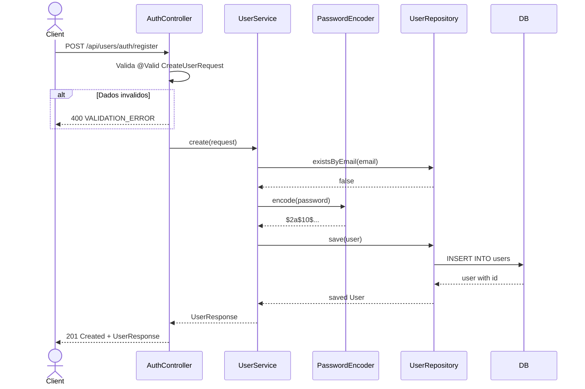
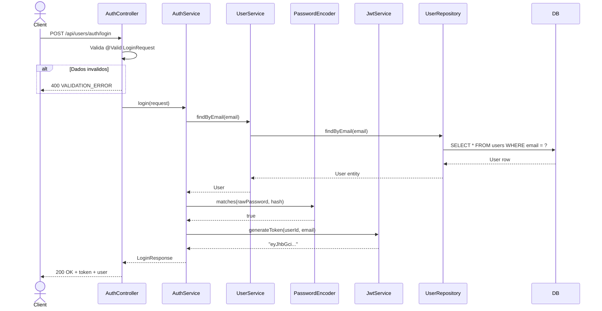
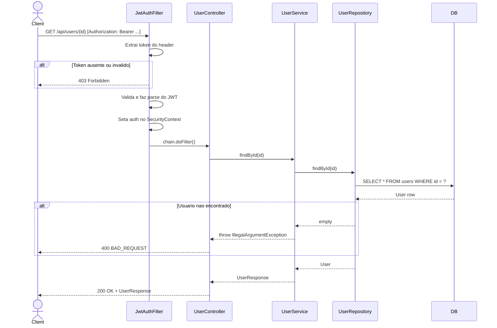
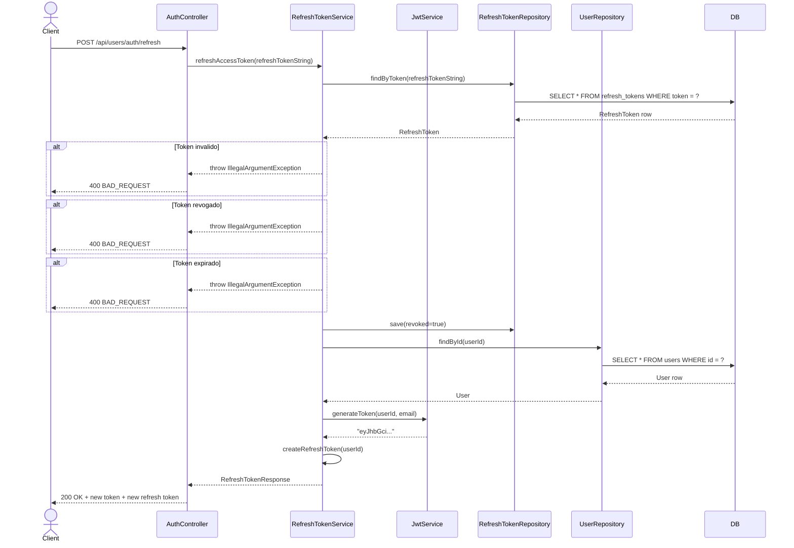

# System Feature Flows

> Registro historico e incremental dos fluxos internos de cada funcionalidade.
> Este documento cresce a cada nova feature implementada e **nunca tem secoes removidas**.

---

## Indice

- [Visao Geral da Arquitetura](#visao-geral-da-arquitetura)
- [Convencoes deste Documento](#convencoes-deste-documento)
- [Feature: Registro de Usuario](#feature-registro-de-usuario)
- [Feature: Autenticacao JWT](#feature-autenticacao-jwt)
- [Feature: Consulta Protegida](#feature-consulta-protegida)
- [Feature: Refresh Token](#feature-refresh-token)
- [Feature: Verificacao de Email](#feature-verificacao-de-email)
- [Feature: Recuperacao de Senha](#feature-recuperacao-de-senha)

---

## Visao Geral da Arquitetura

> Arquitetura MVC monolitica dentro do contexto do microservico Spring Boot.

**Padrao arquitetural:** MVC (Controller — Service — Repository)

**Fluxo global de uma requisicao:**

```
HTTP Request
    └── Controller (Presentation)
            └── Service (Application/Business)
                    └── Repository (Data Access)
                            └── PostgreSQL
```

**Camadas e responsabilidades:**

| Camada         | Responsabilidade                                                  |
|----------------|-------------------------------------------------------------------|
| `controller`   | Receber requisicoes, validar DTOs com Jakarta Validation, formatar resposta |
| `service`      | Orquestrar regras de negocio, coordenar repositorios e servicos internos |
| `model`        | Entidades JPA mapeando as tabelas do banco |
| `repository`   | Acesso a dados via Spring Data JPA |
| `config`       | Configuracoes de seguranca, filtros, beans |

---

## Convencoes deste Documento

- **Erros de dominio** sao lancados como `IllegalArgumentException`
- **Erros de validacao** sao capturados pelo `GlobalExceptionHandler` e retornam 400
- **Erros nao esperados** retornam 500 com envelope padrao
- **DTOs** trafegam entre controller e service; **Entidades** sao usadas apenas no service/repository
- **Respostas de erro** seguem o envelope `{ "data": null, "error": { "code", "message", "details" }, "meta": { "requestId", "timestamp" } }`

---

---

# Feature: Registro de Usuario

> **Versao:** 1.0.0
> **Implementada em:** 2026-06-16
> **Status:** Concluida

---

## Resumo

Permite que um novo usuario crie uma conta no sistema fornecendo nome, email e senha. A senha e armazenada como hash BCrypt. O email deve ser unico.

**Motivacao:** Necessidade de cadastro de usuarios para acesso a plataforma ecom.
**Resultado:** Usuarios podem se registrar e receber um `UserResponse` com os dados cadastrados.

---

## Fluxo Principal

### 1. Ponto de Entrada

- **Tipo:** HTTP REST
- **Arquivo:** `src/main/java/com/ecom/user/controller/AuthController.java`
- **Rota/Evento:** `POST /api/users/auth/register`
- **Autenticacao:** Publica

---

### 2. Validacao de Entrada

- **Arquivo:** `src/main/java/com/ecom/user/dto/CreateUserRequest.java`
- **Biblioteca:** Jakarta Validation (`jakarta.validation`)

| Campo | Tipo | Obrigatorio | Regra de validacao |
|-------|------|-------------|---------------------|
| `name` | String | Sim | `@NotBlank`, `@Size(max = 255)` |
| `email` | String | Sim | `@NotBlank`, `@Email`, `@Size(max = 255)` |
| `password` | String | Sim | `@NotBlank`, `@Size(min = 6, max = 100)` |
| `document` | String | Nao | `@Size(max = 20)` |
| `phone` | String | Nao | `@Size(max = 20)` |

**Falha de validacao:** retorna `400 Bad Request` com codigo `VALIDATION_ERROR` e detalhes dos campos invalidos.

---

### 3. Orquestracao da Aplicacao

- **Arquivo:** `src/main/java/com/ecom/user/service/UserService.java`

1. `UserService.create()` recebe o `CreateUserRequest`
2. Verifica se o email ja esta em uso via `userRepository.existsByEmail()`
3. Cria uma nova entidade `User` e popula os campos
4. Codifica a senha com `passwordEncoder.encode()` (BCrypt)
5. Persiste via `userRepository.save()`
6. Retorna `UserResponse` (sem a senha)

---

### 4. Regras de Negocio

| Regra | Descricao | Localizacao no Codigo |
|-------|-----------|----------------------|
| Email unico | Nao pode existir dois usuarios com o mesmo email | `UserService.java:22` |
| Senha hasheada | A senha nunca e armazenada em texto puro | `UserService.java:29` |

---

### 5. Persistencia / Integracoes

**Repositorios utilizados:**

| Repository | Operacao | Arquivo |
|------------|----------|---------|
| `UserRepository` | `existsByEmail()` + `save()` | `UserService.java` |

---

### 6. Resposta Final

**Sucesso — `201 Created`:**

```json
{
  "id": "uuid-do-usuario",
  "name": "Joao Silva",
  "email": "joao@email.com",
  "document": null,
  "phone": null,
  "createdAt": "2026-06-16T10:00:00"
}
```

**Campos retornados:**

| Campo | Tipo | Descricao |
|-------|------|-----------|
| `id` | String | UUID do usuario |
| `name` | String | Nome do usuario |
| `email` | String | Email do usuario |
| `document` | String ou null | Documento fiscal |
| `phone` | String ou null | Telefone |
| `createdAt` | String (ISO) | Data de criacao |

---

## Fluxos Alternativos e Erros

| Cenário | HTTP Status | Codigo de Erro | Mensagem |
|---------|-------------|----------------|----------|
| Email ja cadastrado | 400 | `BAD_REQUEST` | "Email already in use" |
| Dados invalidos (ex.: email mal formatado) | 400 | `VALIDATION_ERROR` | "Validation failed" com detalhes |

> Todos os erros retornam o mesmo envelope:
> ```json
> { "data": null, "error": { "code": "ERROR_CODE", "message": "...", "details": null }, "meta": { "requestId": "uuid", "timestamp": "..." } }
> ```

---

## Diagrama de Sequencia



---

## Decisoes Tecnicas

### ADR-REG-001 — BCrypt para hashing de senha

| Campo | Detalhe |
|-------|---------|
| **Status** | Aceita |
| **Data** | 2026-06-16 |
| **Contexto** | Necessario algoritmo seguro e amplamente adotado para hashing de senhas |
| **Decisao** | Usar `BCryptPasswordEncoder` do Spring Security com forca padrao (10 rounds) |
| **Consequencias** | Senha armazenada com salt embutido; impossibilidade de reversao; custo computacional aceitavel |

---

---

# Feature: Autenticacao JWT

> **Versao:** 1.0.0
> **Implementada em:** 2026-06-16
> **Status:** Concluida

---

## Resumo

Permite que um usuario registrado faca login com email e senha e receba um token JWT para autenticacao em requisicoes protegidas.

**Motivacao:** Necessidade de autenticacao stateless entre microservicos.
**Resultado:** Usuarios recebem um token JWT com 24h de expiracao contendo `sub` (user ID) e `email`.

---

## Fluxo Principal

### 1. Ponto de Entrada

- **Tipo:** HTTP REST
- **Arquivo:** `src/main/java/com/ecom/user/controller/AuthController.java`
- **Rota/Evento:** `POST /api/users/auth/login`
- **Autenticacao:** Publica

---

### 2. Validacao de Entrada

- **Arquivo:** `src/main/java/com/ecom/user/dto/LoginRequest.java`
- **Biblioteca:** Jakarta Validation

| Campo | Tipo | Obrigatorio | Regra de validacao |
|-------|------|-------------|---------------------|
| `email` | String | Sim | `@NotBlank`, `@Email` |
| `password` | String | Sim | `@NotBlank` |

---

### 3. Orquestracao da Aplicacao

- **Arquivo:** `src/main/java/com/ecom/user/service/AuthService.java`

1. `AuthService.login()` recebe o `LoginRequest`
2. Busca o usuario por email via `UserService.findByEmail()`
3. Verifica a senha com `passwordEncoder.matches()`
4. Gera o token JWT via `JwtService.generateToken(userId, email)`
5. Retorna `LoginResponse` com token, expiracao e dados do usuario

---

### 4. Regras de Negocio

| Regra | Descricao | Localizacao no Codigo |
|-------|-----------|----------------------|
| Senha incorreta | Retorna erro sem revelar se o email existe | `AuthService.java:31` |
| Token com sub=userId | O subject do JWT e o UUID do usuario, nao o email | `JwtService.java:30` |

---

### 5. Persistencia / Integracoes

**Repositorios utilizados:**

| Repository | Operacao | Arquivo |
|------------|----------|---------|
| `UserRepository` | `findByEmail()` | `UserService.java` |

**Servicos internos:**

| Servico | Operacao | Descricao |
|---------|----------|-----------|
| `JwtService` | `generateToken()` | Cria JWT assinado com HMAC-SHA256, 24h expiry |
| `PasswordEncoder` | `matches()` | Verifica senha contra hash BCrypt |

---

### 6. Resposta Final

**Sucesso — `200 OK`:**

```json
{
  "token": "eyJhbGciOiJIUzI1NiJ9...",
  "expiresIn": 86400000,
  "user": {
    "id": "uuid-do-usuario",
    "name": "Joao Silva",
    "email": "joao@email.com",
    "document": null,
    "phone": null,
    "createdAt": "2026-06-16T10:00:00"
  }
}
```

**Campos retornados:**

| Campo | Tipo | Descricao |
|-------|------|-----------|
| `token` | String | JWT (24h de validade) |
| `expiresIn` | Number | Milissegundos ate expiracao |
| `user` | Object | Dados do usuario (mesmo formato de `UserResponse`) |

---

## Fluxos Alternativos e Erros

| Cenário | HTTP Status | Codigo de Erro | Mensagem |
|---------|-------------|----------------|----------|
| Email nao encontrado | 400 | `BAD_REQUEST` | "User not found" |
| Senha incorreta | 400 | `BAD_REQUEST` | "Invalid credentials" |

---

## Diagrama de Sequencia



---

## Decisoes Tecnicas

### ADR-JWT-001 — JJWT 0.12.6 para manipulacao de JWT

| Campo | Detalhe |
|-------|---------|
| **Status** | Aceita |
| **Data** | 2026-06-16 |
| **Contexto** | Necessario gerar e validar JWTs de forma segura com suporte a HMAC-SHA256 |
| **Decisao** | Usar a biblioteca JJWT (io.jsonwebtoken) versao 0.12.6 |
| **Consequencias** | API fluente e segura; dependencia leve com 3 modulos (api, impl, jackson) |

### ADR-JWT-002 — 24h de expiracao do token

| Campo | Detalhe |
|-------|---------|
| **Status** | Aceita |
| **Data** | 2026-06-16 |
| **Contexto** | Definir tempo de vida do token JWT |
| **Decisao** | 24 horas (86400000 ms) configurado via `jwt.expiration` no `application.properties` |
| **Consequencias** | Tokens de longa duracao simplificam o UX inicial; refresh token sera necessario no futuro para renovacao sem re-login |

---

---

# Feature: Consulta Protegida

> **Versao:** 1.0.0
> **Implementada em:** 2026-06-16
> **Status:** Concluida

---

## Resumo

Permite que um usuario autenticado consulte seus proprios dados por ID. A rota e protegida pelo `JwtAuthFilter` e exige token Bearer valido.

**Motivacao:** Expor dados do usuario para outros microservicos e frontends de forma segura.
**Resultado:** Apenas requisicoes com JWT valido conseguem acessar dados de usuario.

---

## Fluxo Principal

### 1. Ponto de Entrada

- **Tipo:** HTTP REST
- **Arquivo:** `src/main/java/com/ecom/user/controller/UserController.java`
- **Rota/Evento:** `GET /api/users/{id}`
- **Autenticacao:** JWT obrigatorio (Bearer token)

---

### 2. Validacao de Token

- **Arquivo:** `src/main/java/com/ecom/user/config/JwtAuthFilter.java`

O `JwtAuthFilter` (estende `OncePerRequestFilter`) executa antes do controller:

1. Extrai o header `Authorization`
2. Se ausente ou sem prefixo `Bearer `, passa adiante (oSecurityConfig negara a requisicao)
3. Extrai o token (remove "Bearer ")
4. Valida e faz parse com `JwtService.parseToken()`
5. Se valido: cria `UsernamePasswordAuthenticationToken` e insere no `SecurityContextHolder`
6. Se invalido: limpa o contexto e passa adiante (a requisicao sera negada como 403)

---

### 3. Orquestracao da Aplicacao

- **Arquivo:** `src/main/java/com/ecom/user/service/UserService.java`

1. `UserService.findById()` recebe o `id` da URL
2. Busca no banco via `userRepository.findById()`
3. Retorna `UserResponse` com os dados do usuario

---

### 4. Regras de Negocio

| Regra | Descricao | Localizacao no Codigo |
|-------|-----------|----------------------|
| Usuario inexistente | Retorna 400 com `BAD_REQUEST` | `UserService.java:38-39` |
| Token invalido/expirado | Retorna 403 Forbidden | `JwtAuthFilter.java:46-48` + `SecurityConfig` |

---

### 5. Persistencia / Integracoes

**Repositorios utilizados:**

| Repository | Operacao | Arquivo |
|------------|----------|---------|
| `UserRepository` | `findById()` | `UserService.java` |

---

### 6. Resposta Final

**Sucesso — `200 OK`:**

```json
{
  "id": "uuid-do-usuario",
  "name": "Joao Silva",
  "email": "joao@email.com",
  "document": null,
  "phone": null,
  "createdAt": "2026-06-16T10:00:00"
}
```

---

## Fluxos Alternativos e Erros

| Cenário | HTTP Status | Codigo de Erro | Mensagem |
|---------|-------------|----------------|----------|
| Token ausente | 403 | — | Forbidden (Spring Security padrao) |
| Token invalido/expirado | 403 | — | Forbidden (Spring Security padrao) |
| Usuario nao encontrado | 400 | `BAD_REQUEST` | "User not found" |

---

## Diagrama de Sequencia



---

## Configuracoes de Seguranca

- **Arquivo:** `src/main/java/com/ecom/user/config/SecurityConfig.java`

A `SecurityFilterChain` define:

| Rota / Metodo | Acesso |
|---------------|--------|
| `GET /health`, `/live`, `/ready` | Permitido (publico) |
| `POST /api/users/auth/register` | Permitido (publico) |
| `POST /api/users/auth/login` | Permitido (publico) |
| `POST /api/users/auth/refresh` | Permitido (publico) |
| `POST /api/users/auth/verify-email` | Permitido (publico) |
| `POST /api/users/auth/resend-verification` | Permitido (publico) |
| `POST /api/users/auth/forgot-password` | Permitido (publico) |
| `POST /api/users/auth/reset-password` | Permitido (publico) |
| Qualquer outra rota | Autenticado (JWT obrigatorio) |

- **Sessao:** STATELESS (sem sessao HTTP)
- **CSRF:** Desabilitado (API REST)
- **PasswordEncoder:** `BCryptPasswordEncoder`

---

## Decisoes Tecnicas

### ADR-SEC-001 — Filtro JWT antes do UsernamePasswordAuthenticationFilter

| Campo | Detalhe |
|-------|---------|
| **Status** | Aceita |
| **Data** | 2026-06-16 |
| **Contexto** | Necessario validar JWT antes que o Spring Security processe a autenticacao padrao |
| **Decisao** | Adicionar `JwtAuthFilter` com `addFilterBefore(jwtAuthFilter, UsernamePasswordAuthenticationFilter.class)` |
| **Consequencias** | O JWT e validado antes de qualquer outra logica de autenticacao; o `SecurityContextHolder` recebe o principal |

---

---

# Feature: Refresh Token

> **Versao:** 1.1.0
> **Implementada em:** 2026-06-16
> **Status:** Concluida

---

## Resumo

Permite renovar o access token JWT sem que o usuario precise reenviar suas credenciais. Utiliza um refresh token de longa duracao (7 dias) com rotacao — a cada uso o token antigo e revogado e um novo e emitido.

**Motivacao:** Evitar que usuarios precisem re-logar a cada 24h quando o JWT expirar.
**Resultado:** Clientes podem obter um novo access token via `POST /api/users/auth/refresh` usando o refresh token recebido no login.

---

## Fluxo Principal

### 1. Ponto de Entrada

- **Tipo:** HTTP REST
- **Arquivo:** `src/main/java/com/ecom/user/controller/AuthController.java`
- **Rota/Evento:** `POST /api/users/auth/refresh`
- **Autenticacao:** Publica

---

### 2. Validacao de Entrada

- **Arquivo:** `src/main/java/com/ecom/user/dto/RefreshTokenRequest.java`

| Campo | Tipo | Obrigatorio | Regra de validacao |
|-------|------|-------------|---------------------|
| `refreshToken` | String | Sim | `@NotBlank` |

---

### 3. Orquestracao da Aplicacao

- **Arquivo:** `src/main/java/com/ecom/user/service/RefreshTokenService.java`

1. `RefreshTokenService.refreshAccessToken()` recebe a string do refresh token
2. Busca o token no banco via `RefreshTokenRepository.findByToken()`
3. Valida: token existe, nao revogado, nao expirado
4. Revoga o token atual (`revoked = true`)
5. Cria um novo refresh token (UUID, 7 dias de expiracao)
6. Gera um novo JWT via `JwtService.generateToken()`
7. Retorna `RefreshTokenResponse` com novo JWT, novo refresh token e `expiresIn`

---

### 4. Regras de Negocio

| Regra | Descricao | Localizacao no Codigo |
|-------|-----------|----------------------|
| Token invalido | String de token que nao existe no banco | `RefreshTokenService.java:35-36` |
| Token revogado | Token ja utilizado anteriormente | `RefreshTokenService.java:38-39` |
| Token expirado | Token com `expiresAt` anterior a now | `RefreshTokenService.java:41-42` |
| Rotacao de token | Token antigo e revogado e um novo e criado | `RefreshTokenService.java:44-47` |
| Refresh token com 7 dias | UUID armazenado em tabela separada | `RefreshTokenService.java:12` |

---

### 5. Persistencia / Integracoes

**Repositorios utilizados:**

| Repository | Operacao | Arquivo |
|------------|----------|---------|
| `RefreshTokenRepository` | `findByToken()`, `save()`, `revokeAllByUserId()` | `RefreshTokenService.java` |
| `UserRepository` | `findById()` | `RefreshTokenService.java` |

---

### 6. Resposta Final

**Sucesso — `200 OK`:**

```json
{
  "token": "eyJhbGciOiJIUzI1NiJ9...",
  "refreshToken": "uuid-do-novo-refresh-token",
  "expiresIn": 86400000
}
```

**Campos retornados:**

| Campo | Tipo | Descricao |
|-------|------|-----------|
| `token` | String | Novo JWT (24h de validade) |
| `refreshToken` | String | Novo refresh token (7 dias) |
| `expiresIn` | Number | Milissegundos ate expiracao do JWT |

---

### 7. Login Atualizado

O `POST /api/users/auth/login` agora tambem retorna `refreshToken`:

```json
{
  "token": "eyJhbGciOiJIUzI1NiJ9...",
  "refreshToken": "uuid-do-refresh-token",
  "expiresIn": 86400000,
  "user": { ... }
}
```

---

## Fluxos Alternativos e Erros

| Cenário | HTTP Status | Codigo de Erro | Mensagem |
|---------|-------------|----------------|----------|
| Token invalido | 400 | `BAD_REQUEST` | "Invalid refresh token" |
| Token revogado | 400 | `BAD_REQUEST` | "Refresh token revoked" |
| Token expirado | 400 | `BAD_REQUEST` | "Refresh token expired" |

---

## Diagrama de Sequencia



---

## Decisoes Tecnicas

### ADR-RFT-001 — Rotacao de refresh token

| Campo | Detalhe |
|-------|---------|
| **Status** | Aceita |
| **Data** | 2026-06-16 |
| **Contexto** | Risco de vazamento de refresh token de longa duracao |
| **Decisao** | A cada uso do refresh token, o antigo e revogado e um novo e emitido |
| **Consequencias** | Refresh tokens sao de uso unico; se um token vazar, so pode ser usado uma vez |

### ADR-RFT-002 — 7 dias de expiracao do refresh token

| Campo | Detalhe |
|-------|---------|
| **Status** | Aceita |
| **Data** | 2026-06-16 |
| **Contexto** | Definir tempo de vida do refresh token |
| **Decisao** | 7 dias a partir da criacao, armazenado em `expires_at` |
| **Consequencias** | Usuarios inativos por mais de 7 dias precisam re-logar |

---

---

# Feature: Verificacao de Email

> **Versao:** 1.1.0
> **Implementada em:** 2026-06-16
> **Status:** Concluida (scaffold — sem envio real de email)

---

## Resumo

Fornece a estrutura para verificacao de email de usuarios registrados. Inclui entidade JPA, repositorio, servico com criacao e validacao de token, e endpoints REST. O envio real de email e um stub que retorna o token na resposta.

**Motivacao:** Garantir que os usuarios possuam emails validos antes de acessar funcionalidades criticas.
**Resultado:** Endpoints prontos para integracao com servico de email.

---

## Fluxo Principal

### 1. Pontos de Entrada

- **Tipo:** HTTP REST
- **Arquivo:** `src/main/java/com/ecom/user/controller/AuthController.java`

| Rota | Descricao |
|------|-----------|
| `POST /api/users/auth/verify-email` | Verifica email com token |
| `POST /api/users/auth/resend-verification` | Reenvia token de verificacao |

- **Autenticacao:** Publica

---

### 2. Validacao de Entrada

**VerifyEmailRequest:**

| Campo | Tipo | Obrigatorio | Regra de validacao |
|-------|------|-------------|---------------------|
| `token` | String | Sim | `@NotBlank` |

**ResendVerificationRequest:**

| Campo | Tipo | Obrigatorio | Regra de validacao |
|-------|------|-------------|---------------------|
| `email` | String | Sim | `@NotBlank`, `@Email` |

---

### 3. Orquestracao da Aplicacao

- **Arquivo:** `src/main/java/com/ecom/user/service/EmailVerificationService.java`

**verify(token):**
1. Busca o token no banco via `findByToken()`
2. Valida: token existe, nao verificado anteriormente, nao expirado
3. Marca `verifiedAt = now()`
4. Salva a entidade

**resendToken(email):**
1. Busca usuario por email
2. Gera novo token UUID
3. Salva com `expiresAt = now() + 1 day`
4. Retorna o token (stub — sem envio real)

---

### 4. Regras de Negocio

| Regra | Descricao | Localizacao no Codigo |
|-------|-----------|----------------------|
| Token ja verificado | Retorna erro se `verifiedAt` ja estiver preenchido | `EmailVerificationService.java:31-32` |
| Token expirado | Token com 24h de validade | `EmailVerificationService.java:34-35` |

---

### 5. Persistencia / Integracoes

**Repositorios utilizados:**

| Repository | Operacao | Arquivo |
|------------|----------|---------|
| `EmailVerificationRepository` | `findByToken()`, `save()` | `EmailVerificationService.java` |
| `UserRepository` | `findByEmail()` | `EmailVerificationService.java` |

---

### 6. Resposta Final

**Sucesso — verify-email:**
```json
{ "message": "Email verified successfully" }
```

**Sucesso — resend-verification:**
```json
{ "message": "Verification email sent (stub)", "token": "uuid-do-token" }
```

---

## Fluxos Alternativos e Erros

| Cenário | HTTP Status | Codigo de Erro | Mensagem |
|---------|-------------|----------------|----------|
| Token invalido | 400 | `BAD_REQUEST` | "Invalid verification token" |
| Email ja verificado | 400 | `BAD_REQUEST` | "Email already verified" |
| Token expirado | 400 | `BAD_REQUEST` | "Verification token expired" |

---

---

# Feature: Recuperacao de Senha

> **Versao:** 1.1.0
> **Implementada em:** 2026-06-16
> **Status:** Concluida (scaffold — sem envio real de email)

---

## Resumo

Fornece a estrutura para recuperacao de senha via token. Inclui entidade JPA, repositorio, servico com criacao e validacao de token com reset de senha, e endpoints REST. O envio real de email e um stub que retorna o token na resposta.

**Motivacao:** Permitir que usuarios recuperem acesso a conta sem intervencao manual.
**Resultado:** Endpoints prontos para integracao com servico de email.

---

## Fluxo Principal

### 1. Pontos de Entrada

- **Tipo:** HTTP REST
- **Arquivo:** `src/main/java/com/ecom/user/controller/AuthController.java`

| Rota | Descricao |
|------|-----------|
| `POST /api/users/auth/forgot-password` | Solicita reset de senha |
| `POST /api/users/auth/reset-password` | Executa reset com token |

- **Autenticacao:** Publica

---

### 2. Validacao de Entrada

**ForgotPasswordRequest:**

| Campo | Tipo | Obrigatorio | Regra de validacao |
|-------|------|-------------|---------------------|
| `email` | String | Sim | `@NotBlank`, `@Email` |

**ResetPasswordRequest:**

| Campo | Tipo | Obrigatorio | Regra de validacao |
|-------|------|-------------|---------------------|
| `token` | String | Sim | `@NotBlank` |
| `newPassword` | String | Sim | `@NotBlank`, `@Size(min = 6, max = 100)` |

---

### 3. Orquestracao da Aplicacao

- **Arquivo:** `src/main/java/com/ecom/user/service/PasswordResetService.java`

**createToken(email):**
1. Busca usuario por email via `UserRepository.findByEmail()`
2. Gera token UUID
3. Salva com `expiresAt = now() + 1 hour`
4. Retorna entidade (token e retornado na resposta — stub)

**resetPassword(token, newPassword):**
1. Busca token no banco via `PasswordResetRepository.findByToken()`
2. Valida: token existe, nao usado anteriormente, nao expirado
3. Busca usuario
4. Atualiza senha com `passwordEncoder.encode(newPassword)`
5. Marca `usedAt = now()`
6. Salva usuario e token

---

### 4. Regras de Negocio

| Regra | Descricao | Localizacao no Codigo |
|-------|-----------|----------------------|
| Token ja usado | Retorna erro se `usedAt` ja estiver preenchido | `PasswordResetService.java:43-44` |
| Token expirado | Token com 1h de validade | `PasswordResetService.java:46-47` |
| Senha hasheada | Nova senha e armazenada com BCrypt | `PasswordResetService.java:52` |

---

### 5. Persistencia / Integracoes

**Repositorios utilizados:**

| Repository | Operacao | Arquivo |
|------------|----------|---------|
| `PasswordResetRepository` | `findByToken()`, `save()` | `PasswordResetService.java` |
| `UserRepository` | `findByEmail()`, `findById()`, `save()` | `PasswordResetService.java` |

---

### 6. Resposta Final

**Sucesso — forgot-password:**
```json
{ "message": "Password reset email sent (stub)", "token": "uuid-do-token" }
```

**Sucesso — reset-password:**
```json
{ "message": "Password reset successfully" }
```

---

## Fluxos Alternativos e Erros

| Cenário | HTTP Status | Codigo de Erro | Mensagem |
|---------|-------------|----------------|----------|
| Email nao encontrado (forgot) | 400 | `BAD_REQUEST` | "User not found" |
| Token invalido (reset) | 400 | `BAD_REQUEST` | "Invalid reset token" |
| Token ja usado | 400 | `BAD_REQUEST` | "Reset token already used" |
| Token expirado | 400 | `BAD_REQUEST` | "Reset token expired" |
